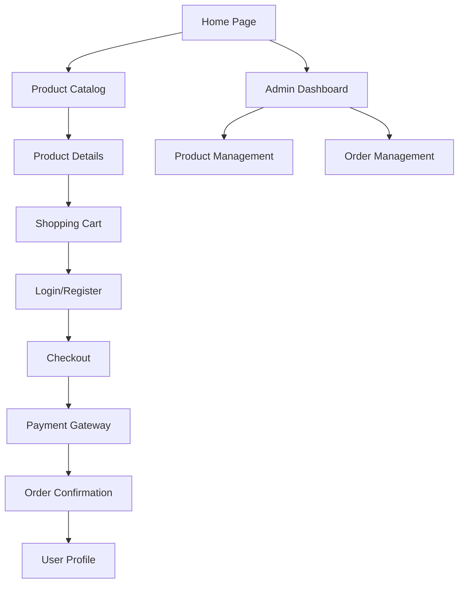

## 1. Product Overview
A full-featured e-commerce platform that enables businesses to sell products online with secure user authentication, comprehensive product management, and seamless payment processing. The platform serves both customers shopping for products and administrators managing inventory and orders.

This platform solves the problem of creating a professional online store without complex setup, providing small to medium businesses with enterprise-level e-commerce capabilities at minimal cost.

## 2. Core Features

### 2.1 User Roles
| Role | Registration Method | Core Permissions |
|------|---------------------|------------------|
| Customer | Email registration | Browse products, add to cart, checkout, view order history |
| Admin | Manual creation by system | Manage products, view analytics, process orders, manage inventory |

### 2.2 Feature Module
Our e-commerce platform consists of the following main pages:
1. **Home page**: product showcase, featured items, navigation menu
2. **Product catalog**: product grid, filtering, search functionality
3. **Product details**: product images, descriptions, pricing, add to cart
4. **Shopping cart**: item management, quantity updates, price calculations
5. **Checkout**: shipping details, payment method, order summary
6. **Login/Register**: user authentication, account creation
7. **Admin dashboard**: product management, order tracking, analytics
8. **User profile**: order history, account settings

### 2.3 Page Details
| Page Name | Module Name | Feature description |
|-----------|-------------|---------------------|
| Home page | Hero section | Display featured products with carousel, promotional banners |
| Home page | Navigation | Top menu with categories, search bar, cart icon with item count |
| Home page | Featured products | Grid layout showing popular items with quick view option |
| Product catalog | Product grid | Display products in responsive grid with pagination |
| Product catalog | Filters | Category, price range, brand filtering with real-time updates |
| Product catalog | Search | Real-time search with autocomplete suggestions |
| Product details | Image gallery | Multiple product images with zoom functionality |
| Product details | Product info | Display name, price, description, specifications |
| Product details | Add to cart | Quantity selector, add to cart button with success feedback |
| Shopping cart | Cart items | List all items with images, prices, quantity controls |
| Shopping cart | Price summary | Subtotal, shipping, tax calculations, total amount |
| Shopping cart | Actions | Update quantities, remove items, continue shopping button |
| Checkout | Shipping form | Address collection with validation, save address option |
| Checkout | Payment method | Razorpay integration, payment method selection |
| Checkout | Order summary | Final item list with total price breakdown |
| Login/Register | Login form | Email/password login with remember me option |
| Login/Register | Register form | Email, password, name registration with validation |
| Admin dashboard | Product management | Add/edit/delete products with image upload |
| Admin dashboard | Order management | View orders, update status, generate invoices |
| Admin dashboard | Analytics | Sales reports, popular products, revenue charts |
| User profile | Order history | List past orders with status tracking |
| User profile | Account settings | Update personal information, change password |

## 3. Core Process
**Customer Flow**: User visits homepage → browses products → adds items to cart → proceeds to checkout → enters shipping details → makes payment via Razorpay → receives order confirmation → can track order in profile.

**Admin Flow**: Admin logs in → accesses dashboard → manages product catalog → processes incoming orders → updates order statuses → views analytics and reports.

## 4. User Interface Design

### 4.1 Design Style
- **Primary colors**: Blue (#2563eb) for primary actions, White (#ffffff) for backgrounds
- **Secondary colors**: Gray (#6b7280) for secondary text, Green (#10b981) for success states
- **Button style**: Rounded corners (8px radius), hover effects with subtle shadows
- **Font**: Inter font family, 16px base size, responsive scaling
- **Layout**: Card-based design with consistent spacing (8px grid system)
- **Icons**: Feather icons for consistency, emoji for user feedback

### 4.2 Page Design Overview
| Page Name | Module Name | UI Elements |
|-----------|-------------|-------------|
| Home page | Hero section | Full-width banner with gradient overlay, promotional text overlay |
| Home page | Product grid | 4-column grid on desktop, 2-column on mobile, hover animations |
| Product details | Image gallery | Left-aligned gallery with main image and thumbnail strip |
| Product details | Info section | Right-aligned product details with sticky add to cart |
| Shopping cart | Cart layout | Centered container with white background, shadow border |
| Checkout | Form layout | Multi-step form with progress indicator, clean white cards |
| Admin dashboard | Dashboard layout | Sidebar navigation with main content area, data tables |

### 4.3 Responsiveness
Desktop-first design approach with mobile adaptation. Touch-optimized interactions for mobile devices. Responsive breakpoints at 768px (tablet) and 1024px (desktop). Hamburger menu for mobile navigation.