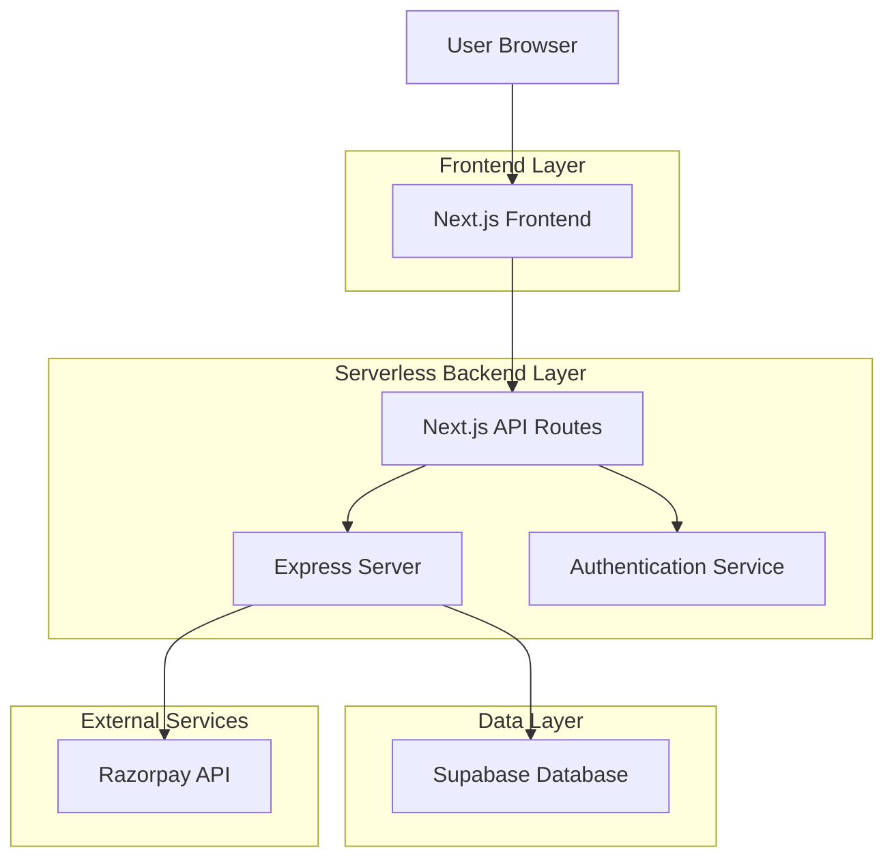
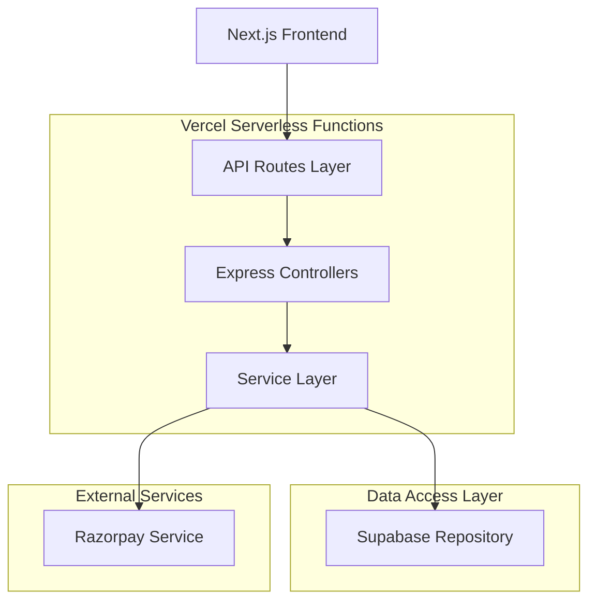
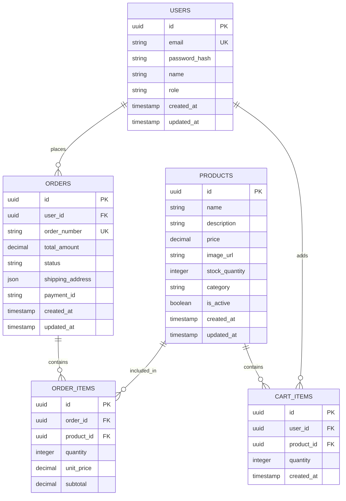

## 1. Architecture Design



## 2. Technology Description

* **Frontend**: Next.js\@14 + React\@18 + TailwindCSS\@3

* **Initialization Tool**: create-next-app

* **Backend**: Express\@4 (integrated as Vercel serverless functions)

* **Database**: Supabase (PostgreSQL)

* **Authentication**: NextAuth.js with Supabase adapter

* **Payment Gateway**: Razorpay SDK

* **Deployment**: Vercel with serverless functions

## 3. Route Definitions

| Route            | Purpose                         |
| ---------------- | ------------------------------- |
| /                | Home page with product showcase |
| /products        | Product catalog with filtering  |
| /products/\[id]  | Individual product details      |
| /cart            | Shopping cart management        |
| /checkout        | Order checkout process          |
| /auth/login      | User authentication             |
| /auth/register   | User registration               |
| /profile         | User account and order history  |
| /admin           | Admin dashboard                 |
| /admin/products  | Product management              |
| /admin/orders    | Order management                |
| /api/auth/\*     | Authentication API endpoints    |
| /api/products/\* | Product CRUD operations         |
| /api/orders/\*   | Order processing                |
| /api/payment/\*  | Razorpay payment integration    |

## 4. API Definitions

### 4.1 Authentication API

```
POST /api/auth/login
```

Request:

| Param Name | Param Type | isRequired | Description        |
| ---------- | ---------- | ---------- | ------------------ |
| email      | string     | true       | User email address |
| password   | string     | true       | User password      |

Response:

| Param Name | Param Type | Description              |
| ---------- | ---------- | ------------------------ |
| token      | string     | JWT authentication token |
| user       | object     | User profile data        |

Example:

```json
{
  "email": "user@example.com",
  "password": "securepassword123"
}
```

### 4.2 Product API

```
GET /api/products
```

Request Query Parameters:

| Param Name | Param Type | isRequired | Description          |
| ---------- | ---------- | ---------- | -------------------- |
| category   | string     | false      | Filter by category   |
| price\_min | number     | false      | Minimum price filter |
| price\_max | number     | false      | Maximum price filter |
| search     | string     | false      | Search term          |
| page       | number     | false      | Page number          |
| limit      | number     | false      | Items per page       |

### 4.3 Order API

```
POST /api/orders/create
```

Request:

| Param Name        | Param Type | isRequired | Description               |
| ----------------- | ---------- | ---------- | ------------------------- |
| items             | array      | true       | Array of product items    |
| shipping\_address | object     | true       | Shipping address details  |
| payment\_method   | string     | true       | Payment method (razorpay) |

### 4.4 Payment API

```
POST /api/payment/create-order
```

Request:

| Param Name | Param Type | isRequired | Description           |
| ---------- | ---------- | ---------- | --------------------- |
| amount     | number     | true       | Order amount in paise |
| currency   | string     | true       | Currency code (INR)   |
| receipt    | string     | true       | Order receipt ID      |

## 5. Server Architecture Diagram



## 6. Data Model

### 6.1 Data Model Definition



### 6.2 Data Definition Language

Users Table:

```sql
CREATE TABLE users (
  id UUID PRIMARY KEY DEFAULT gen_random_uuid(),
  email VARCHAR(255) UNIQUE NOT NULL,
  password_hash VARCHAR(255) NOT NULL,
  name VARCHAR(100) NOT NULL,
  role VARCHAR(20) DEFAULT 'customer' CHECK (role IN ('customer', 'admin')),
  created_at TIMESTAMP WITH TIME ZONE DEFAULT NOW(),
  updated_at TIMESTAMP WITH TIME ZONE DEFAULT NOW()
);

CREATE INDEX idx_users_email ON users(email);
CREATE INDEX idx_users_role ON users(role);
```

Products Table:

```sql
CREATE TABLE products (
  id UUID PRIMARY KEY DEFAULT gen_random_uuid(),
  name VARCHAR(255) NOT NULL,
  description TEXT,
  price DECIMAL(10,2) NOT NULL CHECK (price >= 0),
  image_url VARCHAR(500),
  stock_quantity INTEGER DEFAULT 0 CHECK (stock_quantity >= 0),
  category VARCHAR(100),
  is_active BOOLEAN DEFAULT true,
  created_at TIMESTAMP WITH TIME ZONE DEFAULT NOW(),
  updated_at TIMESTAMP WITH TIME ZONE DEFAULT NOW()
);

CREATE INDEX idx_products_category ON products(category);
CREATE INDEX idx_products_price ON products(price);
CREATE INDEX idx_products_active ON products(is_active);
```

Orders Table:

```sql
CREATE TABLE orders (
  id UUID PRIMARY KEY DEFAULT gen_random_uuid(),
  user_id UUID REFERENCES users(id) ON DELETE CASCADE,
  order_number VARCHAR(20) UNIQUE NOT NULL,
  total_amount DECIMAL(10,2) NOT NULL,
  status VARCHAR(20) DEFAULT 'pending' CHECK (status IN ('pending', 'confirmed', 'shipped', 'delivered', 'cancelled')),
  shipping_address JSONB NOT NULL,
  payment_id VARCHAR(100),
  created_at TIMESTAMP WITH TIME ZONE DEFAULT NOW(),
  updated_at TIMESTAMP WITH TIME ZONE DEFAULT NOW()
);

CREATE INDEX idx_orders_user_id ON orders(user_id);
CREATE INDEX idx_orders_status ON orders(status);
CREATE INDEX idx_orders_created_at ON orders(created_at DESC);
```

Order Items Table:

```sql
CREATE TABLE order_items (
  id UUID PRIMARY KEY DEFAULT gen_random_uuid(),
  order_id UUID REFERENCES orders(id) ON DELETE CASCADE,
  product_id UUID REFERENCES products(id),
  quantity INTEGER NOT NULL CHECK (quantity > 0),
  unit_price DECIMAL(10,2) NOT NULL,
  subtotal DECIMAL(10,2) NOT NULL
);

CREATE INDEX idx_order_items_order_id ON order_items(order_id);
CREATE INDEX idx_order_items_product_id ON order_items(product_id);
```

Cart Items Table:

```sql
CREATE TABLE cart_items (
  id UUID PRIMARY KEY DEFAULT gen_random_uuid(),
  user_id UUID REFERENCES users(id) ON DELETE CASCADE,
  product_id UUID REFERENCES products(id) ON DELETE CASCADE,
  quantity INTEGER NOT NULL CHECK (quantity > 0),
  created_at TIMESTAMP WITH TIME ZONE DEFAULT NOW(),
  UNIQUE(user_id, product_id)
);

CREATE INDEX idx_cart_items_user_id ON cart_items(user_id);
CREATE INDEX idx_cart_items_product_id ON cart_items(product_id);
```

### 6.3 Supabase Row Level Security Policies

```sql
-- Enable RLS
ALTER TABLE users ENABLE ROW LEVEL SECURITY;
ALTER TABLE products ENABLE ROW LEVEL SECURITY;
ALTER TABLE orders ENABLE ROW LEVEL SECURITY;
ALTER TABLE order_items ENABLE ROW LEVEL SECURITY;
ALTER TABLE cart_items ENABLE ROW LEVEL SECURITY;

-- Grant basic permissions
GRANT SELECT ON products TO anon;
GRANT ALL ON products TO authenticated;
GRANT SELECT ON users TO authenticated;
GRANT ALL ON orders TO authenticated;
GRANT ALL ON order_items TO authenticated;
GRANT ALL ON cart_items TO authenticated;

-- Product policies
CREATE POLICY "Products are viewable by everyone" ON products
  FOR SELECT USING (is_active = true);

CREATE POLICY "Admins can manage products" ON products
  FOR ALL USING (
    EXISTS (
      SELECT 1 FROM users 
      WHERE users.id = auth.uid() 
      AND users.role = 'admin'
    )
  );

-- Order policies
CREATE POLICY "Users can view their own orders" ON orders
  FOR SELECT USING (user_id = auth.uid());

CREATE POLICY "Users can create their own orders" ON orders
  FOR INSERT WITH CHECK (user_id = auth.uid());
```

